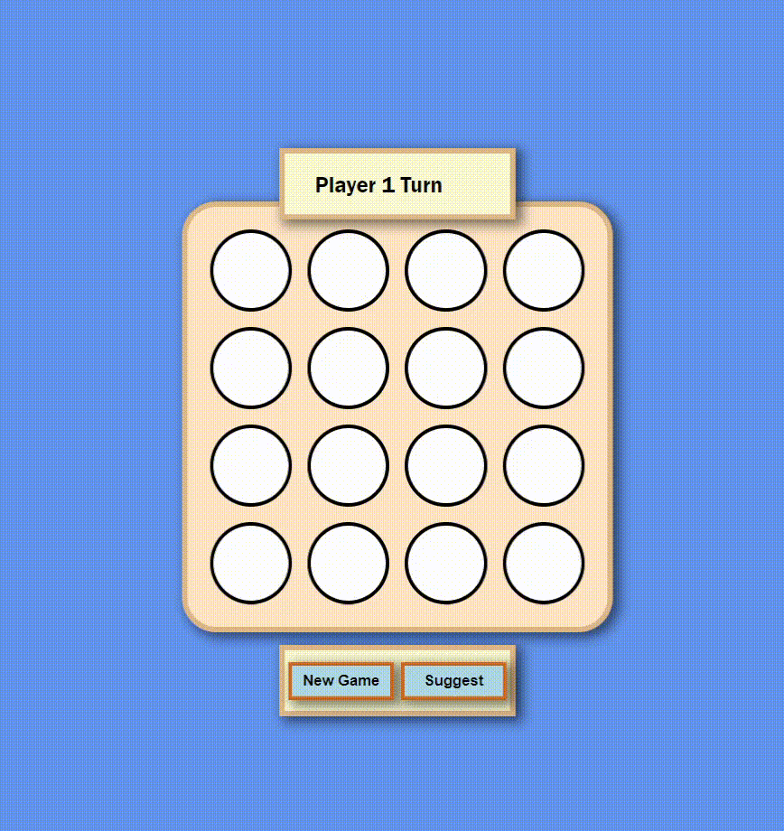

# Connect-4 Game with AI

Welcome to Connect-4, a classic two-player strategy game implemented using ReactJS with an AI-twist. This web application allows two people to play the game against each other and features a basic AI that tries to block your winning moves. Have fun and see who can connect four of their discs in a row first!



## Table of Contents

- [Connect-4 Game with AI](#connect-4-game-with-ai)
  - [Table of Contents](#table-of-contents)
  - [Features](#features)
  - [Getting Started](#getting-started)
  - [Usage](#usage)
  - [AI Implementation](#ai-implementation)
  - [Contributing](#contributing)
  - [License](#license)

## Features

- Play Connect-4 against another person
- Challenge the basic AI that tries to block your winning moves
- Interactive and user-friendly interface built with ReactJS
- Responsive design for a seamless gaming experience on various devices

## Getting Started

To get started with Connect-4 on your local machine, follow these steps:

1. **Clone the repository**:

   ```bash
   git clone https://github.com/mishrakushal/connect-4.git
   ```

2. **Navigate to the project directory**:

   ```bash
   cd connect-4
   ```

3. **Install dependencies**:

   ```bash
   npm install
   ```

4. **Start the development server**:

   ```bash
   npm start
   ```

5. Open your web browser and access the game at `http://localhost:3000`.

## Usage

1. Launch the game by following the "Getting Started" instructions.
2. You can choose to play against another person or challenge the AI.
3. Take turns placing your discs on the game board by clicking on an available column.
4. The game will automatically detect if a player has connected four discs vertically, horizontally, or diagonally to determine the winner.
5. Enjoy the game and have fun competing with your friend or the AI!

## AI Implementation

The basic AI in this Connect-4 game is implemented using a simple algorithm that aims to block the opponent from forming a winning combination. It analyzes the current state of the game board and strategically places its discs to hinder the opponent's progress.

The AI's intelligence level can be adjusted and enhanced to make it more challenging for players who want a tougher opponent.

## Contributing

Contributions are welcome! If you want to contribute to this project, please follow these steps:

1. Fork the repository.
2. Create a new branch for your feature or bug fix.
3. Make your changes and commit them.
4. Push your changes to your fork.
5. Create a pull request, explaining your changes and their benefits.

## License

This project is licensed under the MIT License - see the [LICENSE](LICENSE) file for details.
